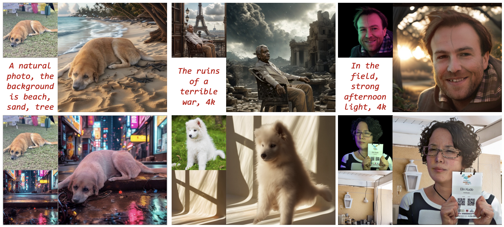
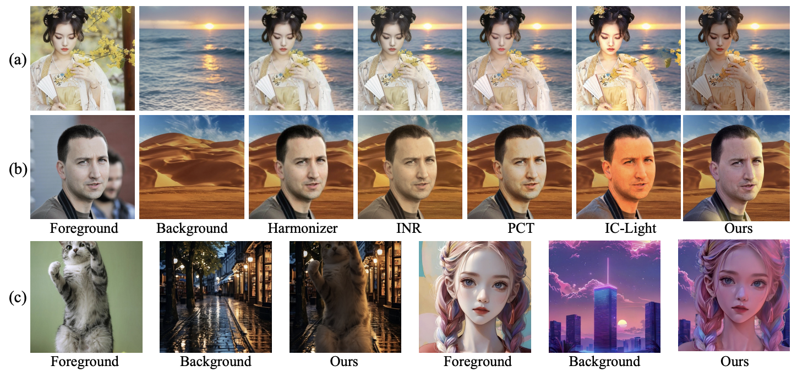

# DreamLight: Towards Harmonious and Consistent Image Relighting
Yong Liu*, Wenpeng Xiao*, Qianqian Wang, Junlin Chen, Shiyin Wang, Yitong Wang, Xinglong Wu, Yansong Tang 
(*equal contribution)


<a href='http://arxiv.org/abs/2506.14549'></a> 


<p align="center">
 
 <!--  -->
</p>

### Abstract
We introduce a model named DreamLight for universal image relighting in this work, which can seamlessly composite subjects into a new background while maintaining aesthetic uniformity in terms of lighting and color tone. The background can be specified by natural images (image-based relighting) or generated from unlimited text prompts (text-based relighting). Existing studies primarily focus on image-based relighting, while with scant exploration into text-based scenarios. Some works employ intricate disentanglement pipeline designs relying on environment maps to provide relevant information, which grapples with the expensive data cost required for intrinsic decomposition and light source. Other methods take this task as an image translation problem and perform pixel-level transformation with autoencoder architecture. While these methods have achieved decent harmonization effects, they struggle to generate realistic and natural light interaction effects between the foreground and background. To alleviate these challenges, we reorganize the input data into a unified format and leverage the semantic prior provided by the pretrained diffusion model to facilitate the generation of natural results. Moreover, we propose a Position-Guided Light Adapter (PGLA) that condenses light information from different directions in the background into designed light query embeddings, and modulates the foreground with direction-biased masked attention. In addition, we present a post-processing module named Spectral Foreground Fixer (SFF) to adaptively reorganize different frequency components of subject and relighted background, which helps enhance the consistency of foreground appearance. Extensive comparisons and user study demonstrate that our DreamLight achieves remarkable relighting performance.

---
<!-- ### 📖 Method
<p align="center">
 
 
</p> -->


### Tab of Content
- [Installation](#1)
- [Usage](#2)
- [Cite](#3)

<span id="1"></span>


We have provided DreamLight based on both FLUX and SD1.5. Genreally, the FLUX version performs better and is recommended. If you find any bugs due to carelessness on our part in organizing the code, feel free to contact us and point that!

### Installation
  Our code is implemented with PyTorch 2.4.1 and CUDA 12.4 by default. 
  Please install the other dependencies as follows:
  ```
  pip install -r requirements.txt
  ```
  - Note that we have updated the corresponding code about light adapter in the code of diffusers, thus please utilie the diffusers in this repo (in FLUX/ and SD15/) to replace the original diffusers. Note that for FLUX-based DreamLight we use diffusers==0.33.1, and SD1.5-based DreamLight we use diffusers==0.30.3.

   


<span id="2"></span>

### Usage

- #### Pretrained Weight
  We have provided the pretrained model weights and the pretrained CLIP image encoder weights. Please download them from [here](https://huggingface.co/LYAWWH/DreamLight/tree/main).
  After downloading, please put the model weights in the ckpt/FLUX/ and ckpt/SD15/ folder.


- #### Inference 
  To perform inference for a group of images, you should enter the corresponding folder (FLUX/ or SD15/) and run the test.py. Take FLUX version as an example:

  ```
  cd FLUX
  python test.py
  ```

  - Note that you should change the 'xxx/xxx' in test.py to the path of your corresponding path.

  - For single image inference, you should set the fg_path, bg_path, save_path, and prompt_path in the corresponding test.py. The prompt is specified by a .txt file.


<span id="3"></span>
### Cite 

If you find our work helpful, we'd appreciate it if you could cite our paper in your work.
```
@article{dreamlight,
  title={DreamLight: Towards Harmonious and Consistent Image Relighting},
  author={Yong Liu, Wenpeng Xiao, Qianqian Wang, Junlin Chen, Shiyin Wang, Yitong Wang, Xinglong Wu, Yansong Tang},
  journal={arXiv preprint arXiv:2506.14549},
  year={2025}
}
```